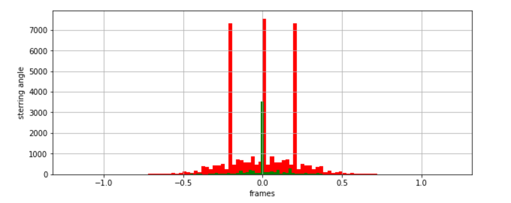
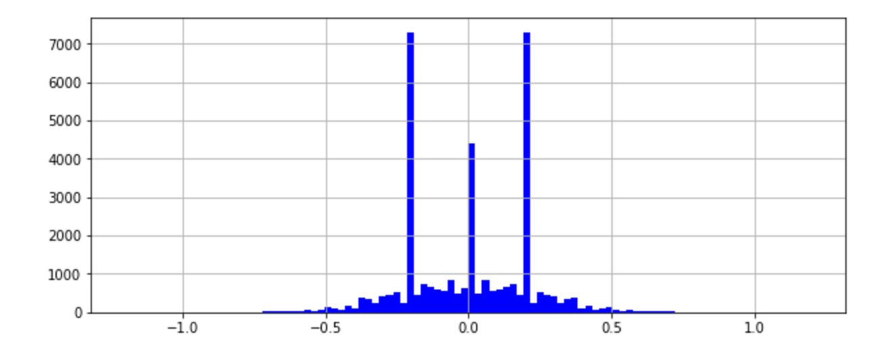
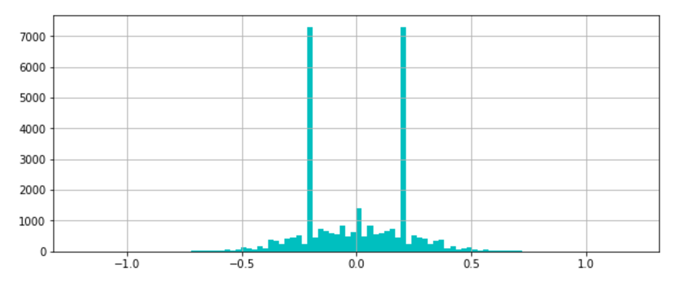
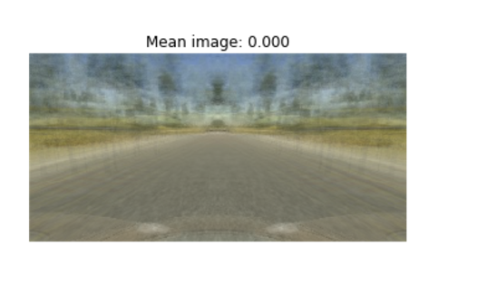
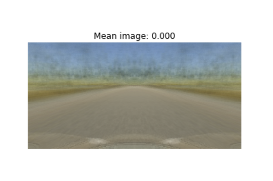
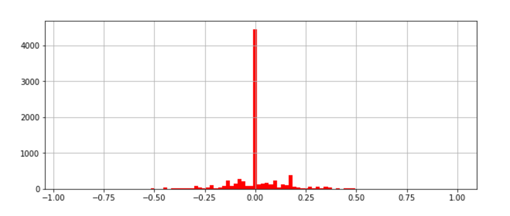
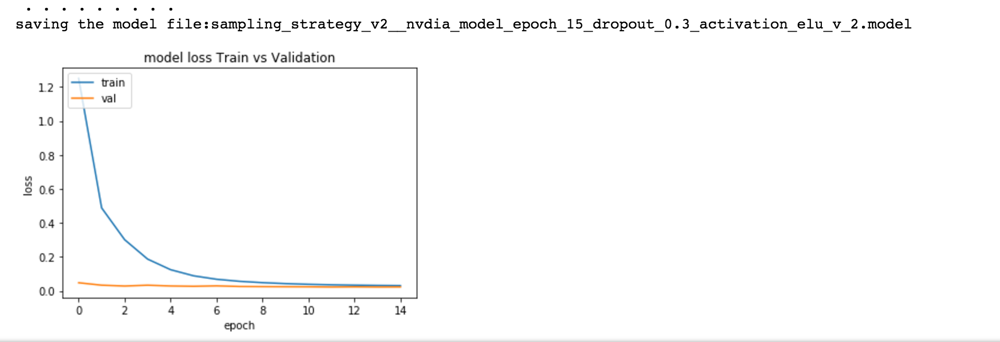

# **Behavioral Cloning** 

---

**Behavioral Cloning Project**

The goals / steps of this project are the following:

* Use the simulator to collect data of good driving behavior
* Build, a convolution neural network in Keras that predicts steering angles from images
* Train and validate the model with a training and validation set
* Test that the model successfully drives around track one without leaving the road
* Summarize the results with a written report


[//]: # (Image References)

[image1]: ./examples/placeholder.png "Model Visualization"
[image2]: ./examples/placeholder.png "Grayscaling"
[image3]: ./examples/placeholder_small.png "Recovery Image"
[image4]: ./examples/placeholder_small.png "Recovery Image"
[image5]: ./examples/placeholder_small.png "Recovery Image"
[image6]: ./examples/placeholder_small.png "Normal Image"
[image7]: ./examples/placeholder_small.png "Flipped Image"

## Rubric Points
### Here I will consider the [rubric points](https://review.udacity.com/#!/rubrics/432/view) individually and describe how I addressed each point in my implementation.  

---
### Files Submitted & Code Quality

#### 1. Submission includes all required files and can be used to run the simulator in autonomous mode

My project includes the following files:

* `model.py` containing the script to create and train the model
* `drive.py` for driving the car in autonomous mode
* `model.h5` containing a trained convolution neural network 
* `README.md` summarizing the results

#### 2. Submission includes functional code
Using the Udacity provided simulator and my drive.py file, the car can be driven autonomously around the track by executing 

```sh
python drive.py model.h5
```

#### 3. Submission code is usable and readable

The model.py file contains the code for training and saving the convolution neural network. The file shows the pipeline I used for training and validating the model, and it contains comments to explain how the code works.

- The code was downloaded from a Python Jupter notebook I used for train/test my model on local machine and AWS.
- The name of the jupter notebook is `Behavior\ cloning\ for\ Driverless\ cars.ipynb`


### Model Architecture and Training Strategy

#### 1. An appropriate model architecture has been employed

- I tried various model architecture to train the model. 

### Model 1: LENET MODEL
- The first layer of the model was the normalization layer. 
- Second layer was Cropping. 
- Then was a Conv 2D layer, with Relu activation filter size 5 x 5 with 6 filter maps. The stride was 1 x 1
- This was followed by Max Pooling with Pool size 2 x 2 and stride 2 x 2 and Dropout.
- Then the second convoluation layer with Relu activation and same filter size of 5 x 5 but had  16 filter maps. The stride used was 1 x 1
- This was followed by Max Pooling with Pool size 2 x 2 and stride 1 x 1 and Dropout.
- Finally, teh outputs from these layers were Flattened.
- Then added 3 Fully connected layer with hiddens units 128, 50 which were sandwiched with Dropout and Relu layers. 
- Finally, since the goal of the model was to predict the sterring angle, the last layer only had 1 unit. 

``` However, this model was a good start but the car was unable to drive in autonoumous mode on first track```	

### Model 2: NVIDA MODEL: 

- Then I trained the model with the following architecture. This was based from the model NVIDA used to drive their car autonomously. 
- The code for the model can be found in the function `create_nvdia_model`. It takes dropout and activation as its argument. 
- I played with dropout of `0.3` and `0.5` and activation layer of `RELU` and `ELU`


```
Layer (type)                     Output Shape          Param #     Connected to                     
====================================================================================================
lambda_3 (Lambda)                (None, 160, 320, 3)   0           lambda_input_3[0][0]             
____________________________________________________________________________________________________
cropping2d_3 (Cropping2D)        (None, 90, 320, 3)    0           lambda_3[0][0]                   
____________________________________________________________________________________________________
convolution2d_12 (Convolution2D) (None, 86, 316, 24)   1824        cropping2d_3[0][0]               
____________________________________________________________________________________________________
maxpooling2d_11 (MaxPooling2D)   (None, 43, 158, 24)   0           convolution2d_12[0][0]           
____________________________________________________________________________________________________
dropout_18 (Dropout)             (None, 43, 158, 24)   0           maxpooling2d_11[0][0]            
____________________________________________________________________________________________________
convolution2d_13 (Convolution2D) (None, 39, 154, 36)   21636       dropout_18[0][0]                 
____________________________________________________________________________________________________
maxpooling2d_12 (MaxPooling2D)   (None, 19, 77, 36)    0           convolution2d_13[0][0]           
____________________________________________________________________________________________________
dropout_19 (Dropout)             (None, 19, 77, 36)    0           maxpooling2d_12[0][0]            
____________________________________________________________________________________________________
convolution2d_14 (Convolution2D) (None, 15, 73, 48)    43248       dropout_19[0][0]                 
____________________________________________________________________________________________________
maxpooling2d_13 (MaxPooling2D)   (None, 7, 36, 48)     0           convolution2d_14[0][0]           
____________________________________________________________________________________________________
dropout_20 (Dropout)             (None, 7, 36, 48)     0           maxpooling2d_13[0][0]            
____________________________________________________________________________________________________
convolution2d_15 (Convolution2D) (None, 5, 34, 64)     27712       dropout_20[0][0]                 
____________________________________________________________________________________________________
maxpooling2d_14 (MaxPooling2D)   (None, 4, 33, 64)     0           convolution2d_15[0][0]           
____________________________________________________________________________________________________
dropout_21 (Dropout)             (None, 4, 33, 64)     0           maxpooling2d_14[0][0]            
____________________________________________________________________________________________________
convolution2d_16 (Convolution2D) (None, 2, 31, 64)     36928       dropout_21[0][0]                 
____________________________________________________________________________________________________
maxpooling2d_15 (MaxPooling2D)   (None, 1, 30, 64)     0           convolution2d_16[0][0]           
____________________________________________________________________________________________________
dropout_22 (Dropout)             (None, 1, 30, 64)     0           maxpooling2d_15[0][0]            
____________________________________________________________________________________________________
flatten_3 (Flatten)              (None, 1920)          0           dropout_22[0][0]                 
____________________________________________________________________________________________________
dense_10 (Dense)                 (None, 1048)          2013208     flatten_3[0][0]                  
____________________________________________________________________________________________________
dropout_23 (Dropout)             (None, 1048)          0           dense_10[0][0]                   
____________________________________________________________________________________________________
dense_11 (Dense)                 (None, 128)           134272      dropout_23[0][0]                 
____________________________________________________________________________________________________
dropout_24 (Dropout)             (None, 128)           0           dense_11[0][0]                   
____________________________________________________________________________________________________
dense_12 (Dense)                 (None, 50)            6450        dropout_24[0][0]                 
____________________________________________________________________________________________________
dropout_25 (Dropout)             (None, 50)            0           dense_12[0][0]                   
____________________________________________________________________________________________________
dense_13 (Dense)                 (None, 10)            510         dropout_25[0][0]                 
____________________________________________________________________________________________________
dropout_26 (Dropout)             (None, 10)            0           dense_13[0][0]                   
____________________________________________________________________________________________________
dense_14 (Dense)                 (None, 1)             11          dropout_26[0][0]                 
====================================================================================================
Total params: 2,285,799
Trainable params: 2,285,799
Non-trainable params: 0
```

```
With dropout of 0.3 and ELU activation, I was able to run the car in autonomous mode.
Although, the car was not leaving the track, it was svering left and right during the inital start. This made be relaized the model is not perfectly stable.
```

### Model 3: NVIDA MODEL v2 (advanced): 

- To solve the drunking model from Model 2, I decided to add more features to the above model.
- The code can be found here `create_nvdia_model_m2`
- I wanted to add BatchNormalization to the model but that was training the model very slow. 
- The only change in model 2 and model 3 was that in model 3 the weigths were being initialized using `he_normal` than the default.


#### 2. Attempts to reduce overfitting in the model

- I added dropout layer in all both arguments of model 2 (`create_nvdia_model`) and model 3 ( `create_nvdia_model_m2`). 

- The model was trained and validated on different data sets to ensure that the model was not overfitting. This was acheived by using `from sklearn.model_selection import train_test_split` and setting the `test size = 0.2`.

- I also used data augumentation to reduce overfitting and removing images which were over represented. This was achieved by the follwing generator function 

```
def generator(log_pd, project_directory, add_left_right_images=True, 
		add_flipped_images=True, correction=0.25,  
		batch_size=32, sample_zero_angle_prob = 1.0, 
		sample_zero_angle_flip_prob = 1.0,
		sample_left_right_zero_angle_correction=1.0):
```
I used this as the setting of the function:

```
generator(train_samples, project_directory, batch_size=batch_size, 
      sample_zero_angle_flip_prob=0.1, 
      sample_zero_angle_prob=0.2, 
	  sample_left_right_zero_angle_correction=0.2)
```


The model was tested by running it through the simulator and ensuring that the vehicle could stay on the track.

#### 3. Model parameter tuning

The model used an adam optimizer, so the learning rate was not tuned manually (model.py line 25).

#### 4. Appropriate training data

Training data provided by the Udacity team was chosen to keep the vehicle driving on the road. I used a combination of center lane driving and data augumentation to helo keep the car driving on the middle of the road. 

For details about how I created the training data, see the next section. 

### Model Architecture and Training Strategy

#### 1. Solution Design Approach

The overall strategy for deriving a model architecture was to ...

- My first step was to train a model end to end with a very basic architecture. This was needed to that I have the pipeline ready even if my results were sub-optimal. My initial model was single layer FC neural net.
- Then I started with a LeNet model. Uptill till point the car was driving fine on straight roads but crashed in small curves. This suggested that my model was not trained well on curving roads but only staright roads. 

To Combat overrfitting, I tried the following steps:

- My first step was to look into data augumentation techniques. I augumented by training data by flipping the images from Left to right and right to Left. These helped me double by training data. I reversed the value of sterring angle with every split. 
-  Then I added dropout in my model architecture. 

More approaches. 
 
-  Then my next step was to add normalization to the images. Since, the images have 3 channels, the ideas here was to center the data around zero mean and unit variance. 
-  Then later on I added cropping Layer to the model. Some part of the image it not important to the model. Mainly, the hood of the car and the top portion which was the sky part was removed from training. 
-  Then I tried by adding Lenet to the model architecture. This was help as the car was driving much better on curved roads. 
-  Later on, I decided to also include images from left and right cameras as well. This trippled my data size as I had input from 2 more cameras. Small correction was applied to the sterring angle. 
-  Then, I modeled my architecture based on the NVIDIA paper. 

But, even with the above steps, the car was going off track at the same position. 


I pondered on two possible approaches, 

- Data augumentation 
- Collect more training data where my car was going off track. 

I picked the former. I started by plotting the sterring angles with and without data augumentation. 


- In the graph above the 
	- `green`: data is the original training data 
	- `red` : whereas the red one is with flipped images added along with images added from left and right cameras. 
	-  As you can see the data has peaked around 0 steering angle and at the 0.2 correction angle.

#### Downsample zero angle flip images
- Then I decided to downsample the images with zero angle and decided not to flip these images. Intutively, it doesn't make sense to add flipped images when the sterring angle is zero. 
- `sample_zero_angle_flip_prob`: This was controlled by adding an argument to the generator function. I set this value to 0.1
- This resulted in the following distribution.

- One can note, that the center line at angle 0 is now less than in color red.

#### Downsample zero angle images
- Even then the zero angle images were highly sampled w.r.t to non-zero sterring angle images.
- Thus, I decided to downsample the images which has zero angle. 
- `sample_zero_angle_prob`: This was controlled by argument `sample_zero_angle_prob`, which I set to 0.2
- It resulted in the following graph. 

- Now, the zero angle distribution is somewhat closer to non-zero angle distribution. 

#### Downsample zero angle left and right camera images. 
- Finally, I decided to down sample adding left and right camera images where the sterring angle was zero. 
- This resulted in the following distribution.


- Finally, I was happy with the sterring angle distribution of my training data.
- Remember, no changes were made to validation data set.


 
At the end of the process, the vehicle is able to drive autonomously around the track without leaving the road.

#### 2. Final Model Architecture

The final model architecture (model.py lines 18-24) consisted of a convolution neural network with the following layers and layer sizes.

Here is a visualization of the architecture 

```
____________________________________________________________________________________________________
Layer (type)                     Output Shape          Param #     Connected to                     
====================================================================================================
lambda_1 (Lambda)                (None, 160, 320, 3)   0           lambda_input_1[0][0]             
____________________________________________________________________________________________________
cropping2d_1 (Cropping2D)        (None, 90, 320, 3)    0           lambda_1[0][0]                   
____________________________________________________________________________________________________
convolution2d_1 (Convolution2D)  (None, 90, 320, 3)    12          cropping2d_1[0][0]               
____________________________________________________________________________________________________
activation_1 (Activation)        (None, 90, 320, 3)    0           convolution2d_1[0][0]            
____________________________________________________________________________________________________
convolution2d_2 (Convolution2D)  (None, 86, 316, 24)   1824        activation_1[0][0]               
____________________________________________________________________________________________________
activation_2 (Activation)        (None, 86, 316, 24)   0           convolution2d_2[0][0]            
____________________________________________________________________________________________________
maxpooling2d_1 (MaxPooling2D)    (None, 43, 158, 24)   0           activation_2[0][0]               
____________________________________________________________________________________________________
dropout_1 (Dropout)              (None, 43, 158, 24)   0           maxpooling2d_1[0][0]             
____________________________________________________________________________________________________
convolution2d_3 (Convolution2D)  (None, 39, 154, 36)   21636       dropout_1[0][0]                  
____________________________________________________________________________________________________
activation_3 (Activation)        (None, 39, 154, 36)   0           convolution2d_3[0][0]            
____________________________________________________________________________________________________
maxpooling2d_2 (MaxPooling2D)    (None, 19, 77, 36)    0           activation_3[0][0]               
____________________________________________________________________________________________________
dropout_2 (Dropout)              (None, 19, 77, 36)    0           maxpooling2d_2[0][0]             
____________________________________________________________________________________________________
convolution2d_4 (Convolution2D)  (None, 15, 73, 48)    43248       dropout_2[0][0]                  
____________________________________________________________________________________________________
activation_4 (Activation)        (None, 15, 73, 48)    0           convolution2d_4[0][0]            
____________________________________________________________________________________________________
maxpooling2d_3 (MaxPooling2D)    (None, 7, 36, 48)     0           activation_4[0][0]               
____________________________________________________________________________________________________
dropout_3 (Dropout)              (None, 7, 36, 48)     0           maxpooling2d_3[0][0]             
____________________________________________________________________________________________________
convolution2d_5 (Convolution2D)  (None, 5, 34, 64)     27712       dropout_3[0][0]                  
____________________________________________________________________________________________________
activation_5 (Activation)        (None, 5, 34, 64)     0           convolution2d_5[0][0]            
____________________________________________________________________________________________________
maxpooling2d_4 (MaxPooling2D)    (None, 4, 33, 64)     0           activation_5[0][0]               
____________________________________________________________________________________________________
dropout_4 (Dropout)              (None, 4, 33, 64)     0           maxpooling2d_4[0][0]             
____________________________________________________________________________________________________
convolution2d_6 (Convolution2D)  (None, 2, 31, 64)     36928       dropout_4[0][0]                  
____________________________________________________________________________________________________
activation_6 (Activation)        (None, 2, 31, 64)     0           convolution2d_6[0][0]            
____________________________________________________________________________________________________
maxpooling2d_5 (MaxPooling2D)    (None, 1, 30, 64)     0           activation_6[0][0]               
____________________________________________________________________________________________________
dropout_5 (Dropout)              (None, 1, 30, 64)     0           maxpooling2d_5[0][0]             
____________________________________________________________________________________________________
flatten_1 (Flatten)              (None, 1920)          0           dropout_5[0][0]                  
____________________________________________________________________________________________________
dense_1 (Dense)                  (None, 1048)          2013208     flatten_1[0][0]                  
____________________________________________________________________________________________________
activation_7 (Activation)        (None, 1048)          0           dense_1[0][0]                    
____________________________________________________________________________________________________
dropout_6 (Dropout)              (None, 1048)          0           activation_7[0][0]               
____________________________________________________________________________________________________
dense_2 (Dense)                  (None, 128)           134272      dropout_6[0][0]                  
____________________________________________________________________________________________________
activation_8 (Activation)        (None, 128)           0           dense_2[0][0]                    
____________________________________________________________________________________________________
dropout_7 (Dropout)              (None, 128)           0           activation_8[0][0]               
____________________________________________________________________________________________________
dense_3 (Dense)                  (None, 50)            6450        dropout_7[0][0]                  
____________________________________________________________________________________________________
activation_9 (Activation)        (None, 50)            0           dense_3[0][0]                    
____________________________________________________________________________________________________
dropout_8 (Dropout)              (None, 50)            0           activation_9[0][0]               
____________________________________________________________________________________________________
dense_4 (Dense)                  (None, 10)            510         dropout_8[0][0]                  
____________________________________________________________________________________________________
activation_10 (Activation)       (None, 10)            0           dense_4[0][0]                    
____________________________________________________________________________________________________
dropout_9 (Dropout)              (None, 10)            0           activation_10[0][0]              
____________________________________________________________________________________________________
dense_5 (Dense)                  (None, 1)             11          dropout_9[0][0]                  
====================================================================================================
Total params: 2,285,811
Trainable params: 2,285,811
Non-trainable params: 0
```
	

#### 3. Creation of the Training Set & Training Process

- I only used the training data provided in the project resources. 
- I extensively used data augumentation and downsampling zero angle images to improve on my model.

- The final downsampling strategy was chosen using the following arguments on my training generator.


```
train_generator = generator(train_samples, project_directory, batch_size=batch_size, 
 sample_zero_angle_flip_prob=0.1, sample_zero_angle_prob=0.2, 
 sample_left_right_zero_angle_correction=0.2
)

validation_generator = generator(validation_samples, project_directory, batch_size=batch_size)
```

Here is the mean image of training data and valdidation data.

| Mean Image Training|   Mean Image Validation | 
|:---------------------:|:---------------------------------------------:| 
|      |    |

One can see that the mean image of training is more blurred than validation data set. This might be from the fact that images from training data set is highly downsample with images having sterring angle to be 0.

| Steering distribution Train|   Sterring distribution validation | 
|:---------------------:|:---------------------------------------------:| 
|      |    |


### Callbacks in Keras: 
- I also used callback in keras to save my model every 3rd epoch. This turn out to be handy to check the car at the epoch of my choice.


 ```
 import keras

	class ModelSaveEveryEpoch(keras.callbacks.Callback):
    filepath="every_epoch:{epoch:02d}.model"
    
    def __init__(self, key):
        self.filepath = key + "_" + self.filepath

    def on_epoch_end(self, epoch, logs={}):
        if epoch %3 == 0:
            file_path = self.filepath.format(epoch=epoch)
            print ("Saving the model at epoch:" + str(file_path))
            self.model.save(file_path)


 ```
### Loss and Epochs
- With droput 0.5:

 
- With droput 0.3:
 
