# **Finding Lane Lines on the Road** 


The goals / steps of this project are the following:

-  Make a pipeline that finds lane lines on the road


[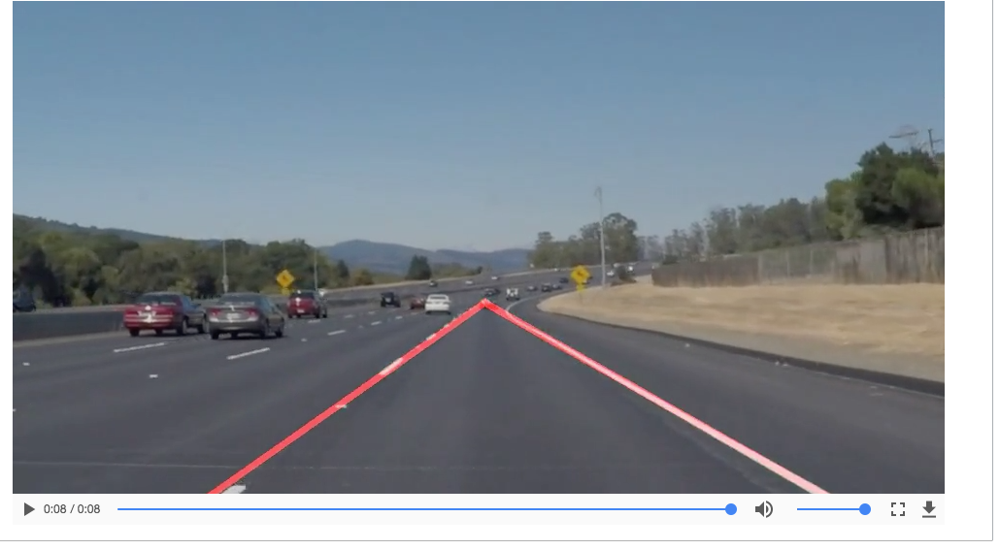](white.mp4)
[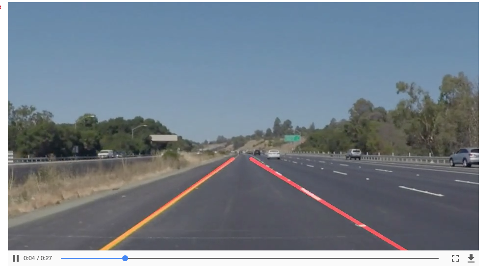](yellow.mp4)


---

### Reflection

### 1. Describe your pipeline. As part of the description, explain how you modified the draw_lines() function.

There are total of 6 stages of my Lane Finding Pipeline. Each stage takes input from the previous step and retruns the output to be used by next step. This also helps in Debugging.

```
def edge_detect_pipeline(image, vertices, kernel_size=5, low_threshold=50,
         high_threshold=150,  rho=2, theta=np.pi/180, threshold=10, min_line_len=3, 
         max_line_gap=14, mode=0):
    images_from_pipeline = []
    step1_image = grayscale(image)
    step2_image = gaussian_blur(step1_image, kernel_size)
    step3_image = canny(step2_image, low_threshold, high_threshold)
    step4_image = region_of_interest(step3_image, vertices)
    step5_image = hough_lines(step4_image, rho, theta, threshold, min_line_len, 
    							max_line_gap, vertices, mode=mode)
    step6_image = weighted_img(step5_image, image)
```
As you can notice, there are many parameters which one can use to run this pipeline. 
Before going into detail og draw_lines(), I would like to add that I tried various parameters to get the best output for each mode.

### Hyperparameters:
- This is not a supervised learning problem, but still I iterated over various permutation of different parameters in edge detection pipeline. 

- Parameters: 

	```
	kernel_sizes = [3, 5, 7]
	low_thresholds = [10, 15, 20, 45]
	high_thresholds = [100, 150, 200]
	rhos=[1, 2] 
	thetas=[np.pi /180] 
	
	thresholds=[10, 15]
	min_line_lens=[3, 5, 10] 
	max_line_gaps=[10, 12]	
	
	```
- Since, there was no accuracy to choose from a list of parameters, I plotted them randomly and picked the combination which looked best to the naked eye. 
- All permutation were run on different modes for `white` and `yellow` file.

### Draw_lines():
- Now lets talk about how I modified this function.

- In all there are `4` modes you can use to run this function. Lets talk about each of them in detail. Each mode is run using a permutation of `Hyperparameters` decribed above. 

- I tried two approaches to code the function draw_lines(). Both the approaches can be run via setting the mode parameter. (`mode == 2` and `mode == 3`)


### Mode == 0
 - This is the default mode and is already provided to us in the course. This iterates over all the segments of lines and draws that on the image. 
 - This is how the ouptut looks for this mode. As you can see, there are only patches of images which are detected as lanes. Also, the title of the image tells what paramter was used to run this image. 


- All the other modes uses a common code, which is used to first partition positive slopes from negative slopes and then from each slope sort the points (x1) in increasing manner. 

```
    if slopes > 0:
        positive_slopes.append([slopes, point_s])
    else:
        negative_slopes.append([slopes, point_s])

```
- This buckets the lines in ones having positive slopes and others having negative slope.
- Next, the points in positve slopes are sorted ascendinly on X1 value, whereas points on -ive slopes are sorted descendingly on x values. This helps in plotting the points in botton to up manner of image view.

```
  # sort them by positive x and -ive x-axis.
    top_k_pos_slopes = sorted(positive_slopes, key=lambda x: x[1][0])[-top_k:]    
    top_k_neg_slopes = sorted(negative_slopes, key=lambda x: -x[1][0])[-top_k:]   
```

### Mode == 1

- This mode is for debugging purposes only. It takes a very simplistic approach. It just draws the line segments belonging to `Positive` slopes and `Negative` slopes. 
- The line from postive slope is drawn with color `blue` whereas line from `negative` slope is drawn with color `green`
- Here is output from `mode == 1` 


### Mode == 2

- It takes a very simplistic approach. I takes the first and last point from the points belonging to `Positive` slopes. Since, they are sorted, this gives the far end points of the segement belonging to positive slopes. The same process is repeated for points from `Negative` slopes. 

```
x1, y1, x2, y2 = top_k_neg_slopes[0][1][0], top_k_neg_slopes[0][1][1], top_k_neg_slopes[-1][1][2], top_k_neg_slopes[-1][1][3]    
cv2.line(img, (x1, y1), (x2, y2), color, thickness)

# get the first and last point for -ive slopes
x1, y1, x2, y2 = top_k_pos_slopes[0][1][0], top_k_pos_slopes[0][1][1], top_k_pos_slopes[-1][1][2], top_k_pos_slopes[-1][1][3]    
cv2.line(img, (x1, y1), (x2, y2), color, thickness)

```

- Here is output from `mode == 2` 


- You can see that some of the images doesn't return good result with this approach. 

### Mode == 3

- Instead of taking the first and last point from the positive slopes, this mode finds the means of all x and y points from the line segements. 
- In all there are 4 mean points to find out , `x1`, `y1`, `x2`, `y2`. 4 each for positve slope and 4 each for negative slope.

```
    pos_x1_mean = int(np.mean(points_xy_pos[0]))
    pos_y1_mean = int(np.mean(points_xy_pos[1]))
    pos_x2_mean = int(np.mean(points_xy_pos[2]))
    pos_y2_mean = int(np.mean(points_xy_pos[3]))

```
- Then the slope is calculated for each of the mean points. 
- `Interpolation`: After calculating the slopes from the mean points, `top x` and `bottom x` points are interpolated keeping corresponding `y` fixed.
- `Bottom x`: Bottom x1 is interpolated by the first `x1` from the sorted array from `mode ==2`, and the mean slope from avg. points. Here Y is kept fixed to be the size of the image.
- `Top x`: Top x2 is interpolated by the last `x2` from the sorted array from `mode ==2`, and using the mean slope from avg. points. Here Y is kept fixed and is teh value taken from the vetices sued to perform poly match.
- Then a line is drawn for `bottom x, y` and `top x,y`
- Same process is repated for points from Negative slopes.

```
  y_bottom = imshape[0]
  y_top  = vertices[0][1][1]

  first_x1,first_y1, _, _ = top_k_pos_slopes[0][1]    
  last_x1,last_y1, _, _ = top_k_pos_slopes[1][1]    
  pos_slope_avg = get_slope(pos_x1_mean,pos_y1_mean,pos_x2_mean,pos_y2_mean)

  right_x1 = int(pos_x1_mean + (y_bottom - pos_y1_mean) / pos_slope_avg)
  right_x2 = int(pos_x2_mean + (y_top - pos_y2_mean) / pos_slope_avg)

```
- Here are the outputs from mode ==3 for various parameters.

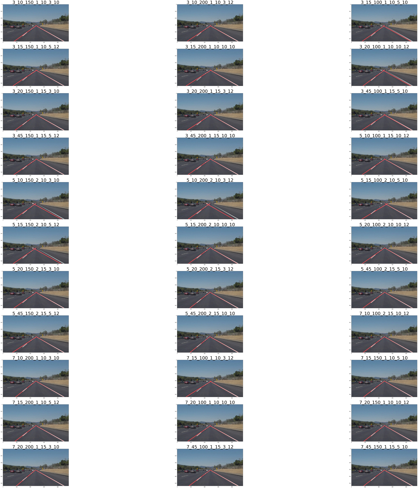

### Mode == 4
- This mode is just for fun and debugging and is used to plot various points and their slopes on map.
- It also ouputs the sequence of images produced by the pipeline. 

Stages of Pipeline| Plots of Slopes
:-------------------------:|:-------------------------:
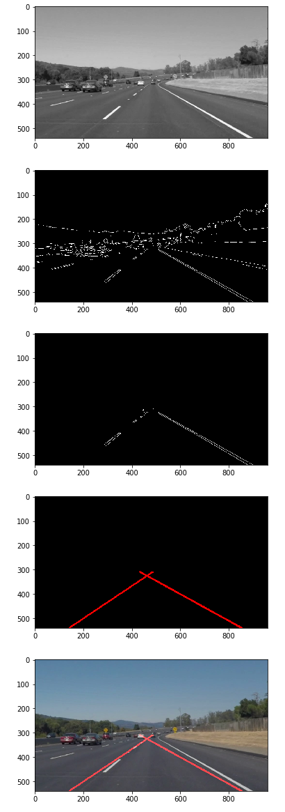  |  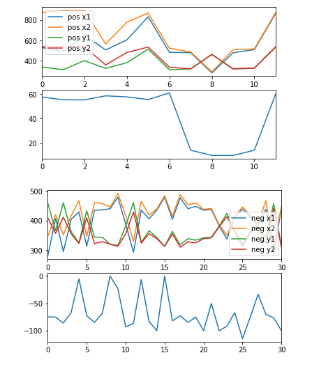

### 2. Identify potential shortcomings with your current pipeline

- One potential shortcoming is that if both positive adnd negative slopes fall on same side of the lane. Then the tracking outputs a wrong lane. Example 


- Another potential is that its very senstive to camera position. Since, `vertices` are fixed, `region_of_interest` results will change in case camera position is changed.


### 3. Suggest possible improvements to your pipeline

- One possible improvement would be to fit a regression line on the image track. This could be a next step over interpolation. Basically, least squares error. ...

- Fit the line using polynomial points, and use better estimation like curves etc
- Use a running window of say 10 frames which can average the results not only on the lines but also on the ouputs from previous frames. 


### 4. Re Work on the pipeline

My last submission mainly had issues with the `solidYellowLeft.mp4` file. In this section, I will talk about what i did to improve upon them.


- The issue was identified earlier in [Identify potential shortcomings with your current pipeline](####3) section of this README.
- The primary issue was that in some cases both the positive and negative slopes were falling on same side of the lane.
- Additionally, the left slope were cross over the right slope line and vice versa.
- Here are some samples from the v1 version of the video


### Propsoed fix for the issue:
- In the re-work, I was focusing on solving the the above mentioned issues. Here are some more sample images of the issue.


Sample issue 1| Sample issue 2|Sample issue 3
:-------------------------:|:-------------------------:|:-------------------------:
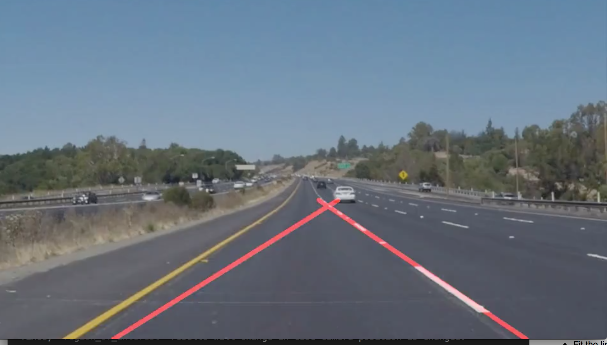  | 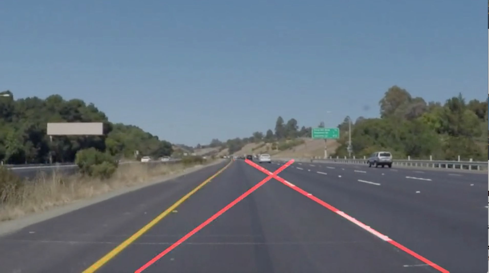| 

#### Idea 
- The idea is pretty simple. 
- For each slope that is generated, we have have two set of points `x1,y1` and `x2,y2`.
- For +ive slopes, only add those points in the list whose `x1` posiiton is greater than `top right x` posiiton of the cropped image and `x2` coordinate is less than bottom right x position of the cropped image. 
- Simiarly, for -ive slopes, onkky add those points whose `x1` positon is less than the top left position and it's `x2` position is more than botton left `x` position.

-  code looks like this

```
    for x1,y1,x2,y2 in line:
            point_s = x1,y1,x2,y2
            slopes = (y2-y1)/(x2-x1)
            if slopes > 0:
            		## trick for positive slope
                if (x1 > top_right[0] and x2 < botton_right[0]):
                    positive_slopes.append([slopes, point_s])                    
            else:
            		# trick for negative slope
                if (x1 < top_left[0] and x2 > botton_left[0]):
                    negative_slopes.append([slopes, point_s])
```

- This resulted in great improvements. 

- The best paramter for running the pipeline was chosen using the earlier discussed CV approach. [Hyperparameters:](## Hyperparameters). More concretely, 
- White 
 
 ```
     kernel_size = 3
    low_threshold = 150
    high_threshold = 300
    rho = 2
    theta = np.pi /180
    thershold = 15
    min_line_len = 15
    max_line_gap = 10

 ```
- Yellow

 ```
  kernel_size = 3
    low_threshold = 150
    high_threshold = 200
    rho = 2
    theta = np.pi /180
    thershold = 30
    min_line_len = 25
    max_line_gap = 7
    mode = 3    
  ```


- Outputs of the images under all 3 modes. 

Mode 1| 
:-------------------------:|
  | 

Mode 2| 
:-------------------------:|
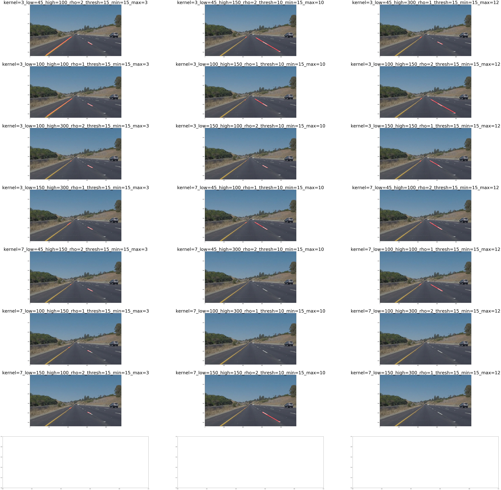| 

Mode 3| 
:-------------------------:|
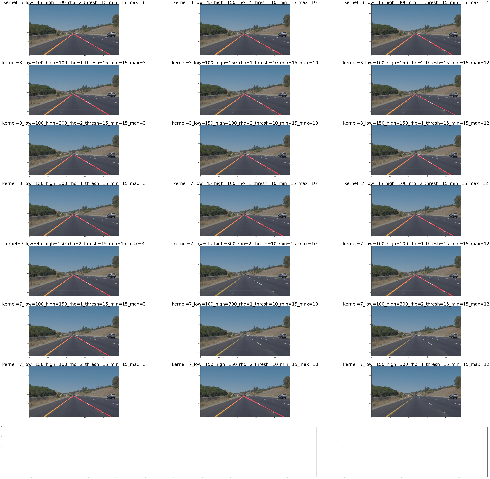|


- the sequence of image generated by the Pipeline 
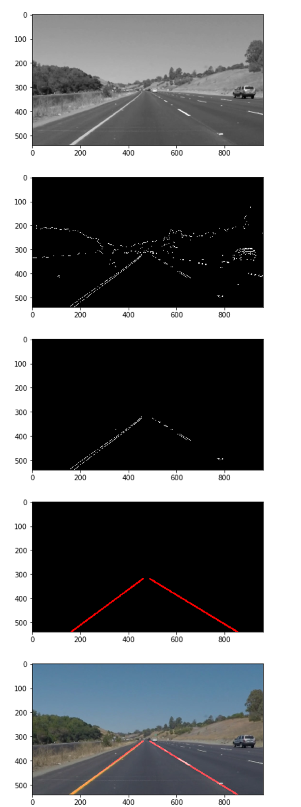

## Final Vidoes (v2 version)
- SolidWhiteRight: 

Version 1 (Wrong) | Version 2(Correct)
:-------------------------:|:-------------------------:|
[](./data/white.mp4 "SolidWhiteRight") |[](./data/v2/white_v2.mp4 "SolidWhiteRight") |


- SolidYellowLeft: 


Version 1 (Wrong) | Version 2(Correct)
:-------------------------:|:-------------------------:|
[](./data/yellow.mp4 "SolidYellowLeft") |[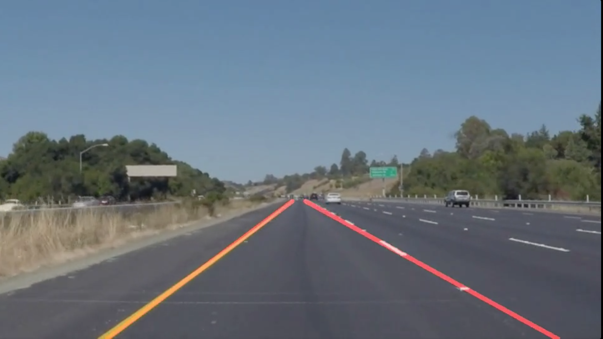](./data/v2/yellow_mode_3.mp4 "SolidYellowLeft") |
